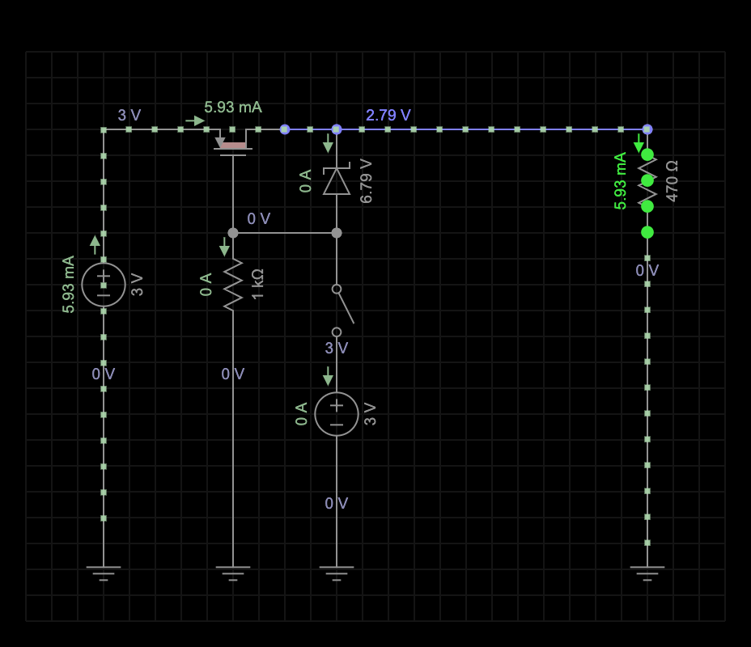

# LED Blink Circuit Project

## Project Description
This is a simple hardware project for Hack Club's Solder submission. It features a blinking LED circuit built on a breadboard. The LED blinks on and off using a basic manual switch. This project is designed to be beginner-friendly and demonstrates basic electronics concepts.

## Bill of Materials (BOM)
- Breadboard (1x, mini or standard size)
- LED (1x, any color, e.g., red, 5mm)
- Resistor (1x, 470 ohms, to limit current to the LED)
- Jumper wires (2-4x, for connections)
- Power source (e.g., 3V battery pack)
- (Optional) Push button or capacitor (for blinking effect, if not using a microcontroller)

**Note**: Parts can be sourced from local electronics stores or online (e.g., Amazon, AliExpress, or DigiKey).

## Schematics, PCB, and 3D Views
- **Schematic**: See the circuit schematic below (designed in EveryCircuit):
  
- **PCB and 3D Views**: This project uses a breadboard instead of a custom PCB, so no PCB design or Gerber files are included. A photo of the breadboard setup will be provided in the /schematics/schematic.png folder once physically assembled.

## Slack Username
My Hack Club Slack username: [Sarah Duan]  
*(Note: Join the Hack Club Slack at slack.hackclub.com if you haven't already, and ensure your username is added here.)*

## Additional Files
This project does not involve a custom PCB, so no Gerber or drill files are included.

All relevant files (schematics, photos, documentation) will be added to the /docs/, /images/, and /schematics/ folders after completing the circuit. The schematic is now included in /schematics/.

## Project Status
Circuit design completed using EveryCircuit. Documentation and schematic updated on 2025-06-07. Physical assembly and photos will be added soon if applicable!

